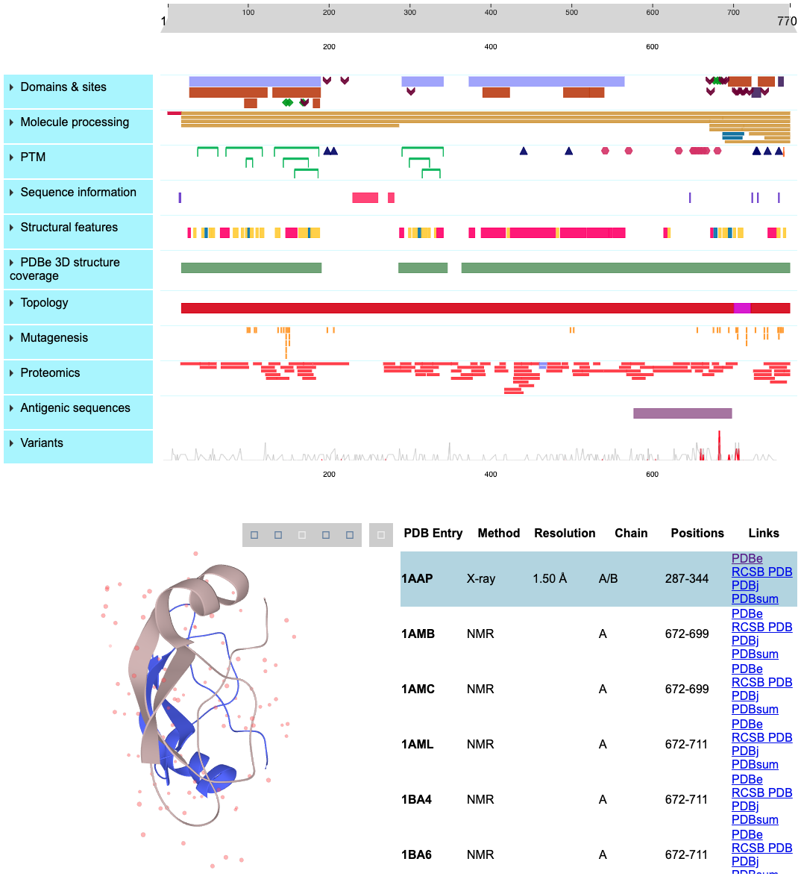

# protvista-uniprot

A Web Component which uses [Nightingale](https://github.com/ebi-webcomponents/nightingale) components to display protein sequence information.



## Usage

### Importing as a module
```
import ProtvistaUniprot from 'protvista-uniprot';
...
window.customElements.define('protvista-uniprot', ProtvistaUniprot);
```
You can then use it like this:
```
<protvista-uniprot accession="P05067" />
```
#### Dependencies
The component relies on d3 and LiteMol (optional) which are set as global variables and need to be added to your project.
```
<script src="https://d3js.org/d3.v4.min.js" charset="utf-8" defer></script>

<!-- Only if you want to use the 3D structure viewer --->
<link rel="stylesheet" href="https://cdn.jsdelivr.net/npm/litemol@2.4.2/dist/css/LiteMol-plugin.min.css" type="text/css"></link>
<script src="https://cdn.jsdelivr.net/npm/litemol@2.4.2/dist/js/LiteMol-plugin.min.js" defer></script>
```

### or via CDN
See [here](https://codepen.io/xwatkins/pen/rXpZXX)

### API
 - accession: String
 - config?: Array [see below](#configuration)
 - notooltip?: Boolean(false)
 - nostructure?: Boolean(false)

## Development

Run `yarn install` to install dependencies and `yarn start` to start the local server.

## Configuration

You can pass your own configuration to the component using the `config` attribute/property.

```
{
  "categories": [
    {
      "name": string,
      "label": string,
      "trackType": protvista-track|protvista-variation-graph|protvista-variation,
      "adapter": protvista-feature-adapter|protvista-structure-adapter|protvista-proteomics-adapter|protvista-variation-adapter,
      "url": string,
      "tracks": [
        {
          "name": string,
          "label": string,
          "filter": string,
          "trackType": "protvista-track|protvista-variation-graph|protvista-variation",
          "tooltip": string
        }
      ]
    }
  ]
}
```

## Events

Custom `protvista-event` are emitted:

- when at least one of the track returns data

```
detail: {
    hasData: true
}
```
